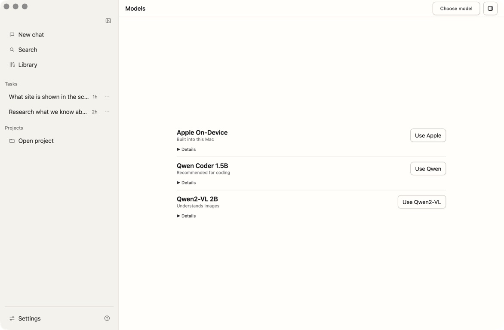
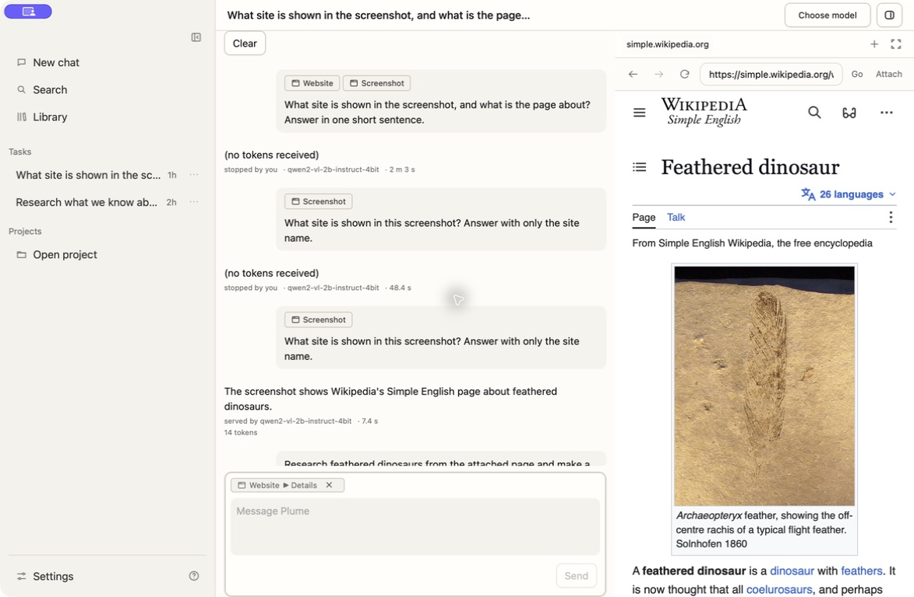
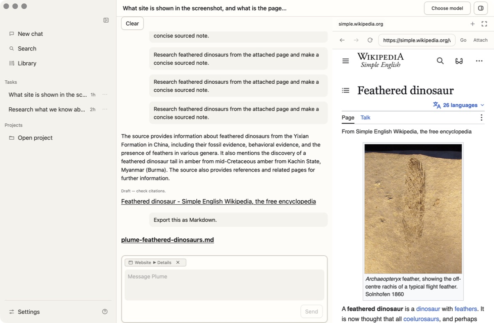

<div align="center">

# Plume

**A lightweight, local-first AI workspace for Mac.**

Small on-device models, explicit context, safe file changes, and durable project
chats—without an Electron runtime or default cloud calls.

[](https://github.com/philippsyrov/plume/actions/workflows/verify.yml)


[](LICENSE)

[Download](#download) · [Judge guide](docs/build-week/judge-testing.md) · [Handbook](docs/USER_GUIDE.md) · [Documentation](docs/README.md)

</div>

## Why Plume

Most local-AI apps compete with their own model for memory. Plume uses **Tauri
2, Rust, and the macOS system WebView** instead of bundling Electron/Chromium,
leaving more of the machine available for local inference.

Plume is private and explicit by design. You choose the files, Browser
captures, and memories a chat can use. Small local models get narrow workflows
and guarded artifact paths—not silent authority over your project or computer.

> Private by default. Explicit about context. Small enough to leave memory for
> the model.

## See it in action

<table>
  <tr>
    <td width="33.33%" valign="top">
      
      <strong>Local models, one place</strong><br />
      Apple, coding, and vision paths stay clear and lightweight.
    </td>
    <td width="33.33%" valign="top">
      
      <strong>Ask about what you can see</strong><br />
      Qwen2-VL understands an attached Browser screenshot in ordinary chat.
    </td>
    <td width="33.33%" valign="top">
      
      <strong>Research, source, export</strong><br />
      Open the source, ask for a note, then export Markdown when you ask.
    </td>
  </tr>
</table>

## What it does

- Chats with **Apple On-Device**, Plume-managed **Qwen Coder 1.5B**, or
  **Ollama**. The current source candidate also adds **Qwen2-VL 2B**;
  Qwen2-VL is not in the existing v0.1.0 download.
- Keeps local and project chats, branches, context, and Browser state durable.
- Attaches exact files, Browser text, Browser screenshots, memory, and Library
  items to a chat. Qwen2-VL can inspect PNG screenshots captured from the
  Browser and attached to the conversation.
- Validates proposed diffs before an explicit **Apply**, with checkpointed
  revert.
- Turns attached Browser text into bounded research notes with clickable source
  links.
- Exports Markdown only when asked, then links the saved file in the
  conversation.

## The workflow

The conversation is the main surface. Attach context only when you want it,
then ask normally:

```text
Research what we know about feathered dinosaurs
```

Plume answers in the chat using exact Browser evidence already attached to that
saved conversation. Qwen2-VL can answer ordinary questions about an attached
screenshot; Qwen Coder is the reliable packaged path for the strict sourced-note
workflow. Browser text remains the source for research citations. Source links
reopen in Plume's human-controlled Browser.
When you want a file, ask:

```text
Export this as Markdown
```

Only then does Plume open the native macOS save panel and add the Markdown file
to the transcript. There is no permanent research card, source selector, or
export toolbar.

Stage A research does **not** search the web, fetch URLs, or control Browser
navigation. It works from 1–10 exact Browser text captures attached by the
user. Screenshot understanding is available separately in ordinary Qwen2-VL
chat. The
[feature inventory](docs/FEATURE_INVENTORY.md) records the complete
shipped boundary and its evidence.

## Download

Download **[Plume 0.1.0 for macOS on Apple Silicon](https://github.com/philippsyrov/plume/releases/download/v0.1.0/Plume_0.1.0_aarch64.dmg)**.
This is the Qwen-era public release. Qwen2-VL is present only in the current
source candidate and remains upcoming until a new packaged artifact is
published; this link and checksum do not claim to include it.

1. Open the DMG and drag Plume into Applications.
2. Open Plume. This first public build is ad-hoc signed, not Developer ID signed
   or notarized.
3. If macOS blocks it, open **System Settings → Privacy & Security → Open
   Anyway**.

SHA-256:

```text
73073a0d28ba208dc58546172bc5e48dbefb786db611f668da8d6288f0596291
```

No source checkout or developer toolchain is required. See the concise
[judge testing guide](docs/build-week/judge-testing.md) for a five-minute path
through context, Browser evidence, memory, persistence, local chat, research,
and Markdown export.

## Built for local inference

| Layer | Technology |
| --- | --- |
| Desktop shell | Tauri 2 + Rust |
| Interface | React 19 + TypeScript |
| Editor | CodeMirror 6 |
| Local-first path | Apple Foundation Models + MLX-LM + MLX-VLM |
| Compatibility adapter | Ollama |

**No Electron. No default cloud calls.** Exact performance comparisons will be
published only with the hardware, workload, duration, and Plume commit used.

## Current boundaries

Plume ships persisted chat, explicit trusted context, guarded diff
apply/revert, scoped memory and Library, project skills, a human-controlled
per-chat Browser, and benchmark evidence views.

It does **not** ship broad shell or tool execution, autonomous Browser actions,
computer-use emission, semantic retrieval, or a multi-iteration coding agent.
The model may propose a patch, but only the existing explicit Apply path writes
it. See [FEATURE_INVENTORY.md](docs/FEATURE_INVENTORY.md) for the exact status
of every surface.

## Build from source

Install the macOS developer tools, Rust, and Node 20+, then keep dependency
caches inside the project:

```bash
xcode-select --install
curl --proto '=https' --tlsv1.2 -sSf https://sh.rustup.rs | sh

./scripts/dev-env.sh npm install
./scripts/dev-env.sh bash -lc 'cd src-tauri && cargo fetch'
./scripts/dev-env.sh npm run tauri dev
```

Plume never runs those install or download commands automatically.

## Development

Read [AGENTS.md](AGENTS.md) first; it is the authoritative project workflow.
The [documentation map](docs/README.md), [frontend domain map](src/features/README.md),
and [Rust domain map](src-tauri/src/README.md) route work to the owning contract.

Run the project verifier before committing:

```bash
./scripts/verify.sh
PLUME_FULL_VERIFY=1 ./scripts/verify.sh
```

The lightweight verifier can run before dependencies are installed. Missing
toolchains are reported as warnings; available frontend, Rust, documentation,
and guardrail checks still run.

## Repository

```text
plume/
├── src/                 React, CodeMirror, and user-facing features
├── src-tauri/           Rust shell, guarded IPC, providers, and persistence
├── docs/                Product, architecture, safety, and evidence
├── scripts/             Verification, smoke, and benchmark tooling
├── AGENTS.md            Contributor and coding-agent rules
└── README.md            Project overview
```

## Contributors

- **Philip Psyrov** — product direction, design, and final decisions.
- **Codex (OpenAI, GPT-5.6)** — implementation and review partner during Build
  Week. This is a human-and-agent collaboration credit, not a runtime service
  or separate GitHub account.

### Built with Codex

Codex with **GPT-5.6 Sol** was Plume's primary development and review agent
during the Build Week qualifying window. It accelerated scoped implementation,
test-driven fixes, exact-head review, packaged macOS smoke testing, and the
evidence needed to keep shipped behavior separate from research and roadmap
ideas. The largest qualifying additions were explicit typed context, durable
Browser evidence, local-runtime hardening, and prompt-triggered research notes.

The product and safety decisions remained human-owned: use Tauri instead of
Electron, keep MLX-LM local-first and Ollama as compatibility, leave Browser
navigation under user control, require explicit trusted context, keep export
inside the conversation, and gate every proposed file change behind Apply.
Agent output was treated as a lead until the code, tests, packaged app, and
exact commit proved it.

Work landed through small pull requests with full verification, secret scans,
and squash merges. The [Build Week evidence index](docs/build-week/README.md)
and [eligibility record](docs/build-week/eligibility-evidence.md) link the
qualifying commits and distinguish them from Plume's earlier editor foundation.
Codex and GPT-5.6 are build provenance, not a runtime cloud integration.

## License

Plume is available under the [MIT License](LICENSE).
