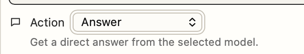
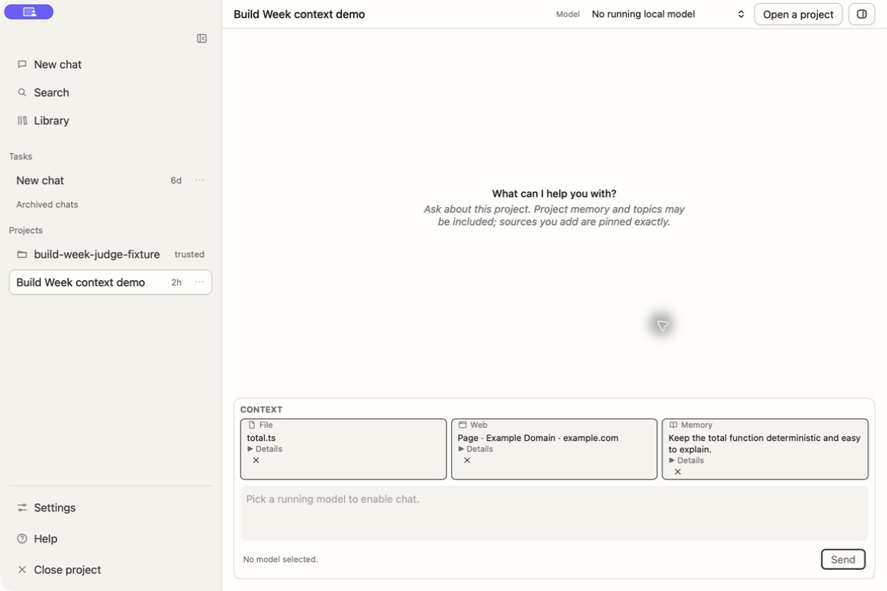
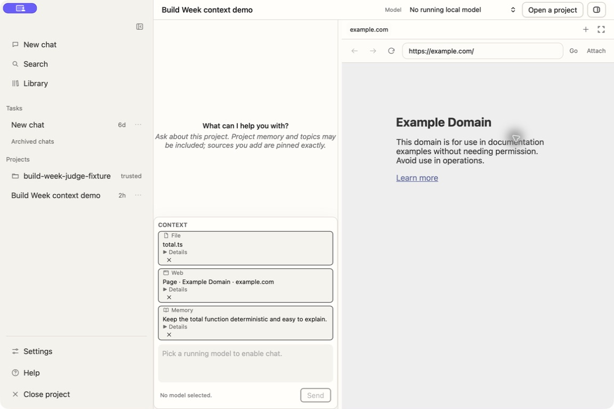

# Packaged UI Audit

The release candidate was exercised in a real packaged `.app` at both the wide
Chat layout and the narrow Browser split. The core path worked, but the first
pass exposed two judge-facing usability problems:

1. The composer presented a large **Action → Answer / Propose a change** selector
   even though answering is the normal behavior. This exposed an internal wire
   mode and made the app feel like a test harness.
2. Attached context sources were dense inline badges with long browser excerpts,
   weak hierarchy, and poor narrow-width containment.

The accepted change keeps ordinary chat implicit, exposes **Make changes** as a
secondary control only when a model is available, and retains the explicit
Apply/Revert safety boundary. Context sources now use a stacked label/name/
details hierarchy, put long evidence previews behind **Details**, and stack
cleanly in Browser split.

The accepted screenshots below were recaptured from the packaged app built at
durable artifact-source commit `2a3520e`. They visibly distinguish bounded
ambient project memory/topics from sources the user pins exactly.

## Evidence

Before:

Accepted wide Chat state:

Accepted Browser split state:

Intermediate screenshots are retained as dated audit evidence, not as current
design references.
